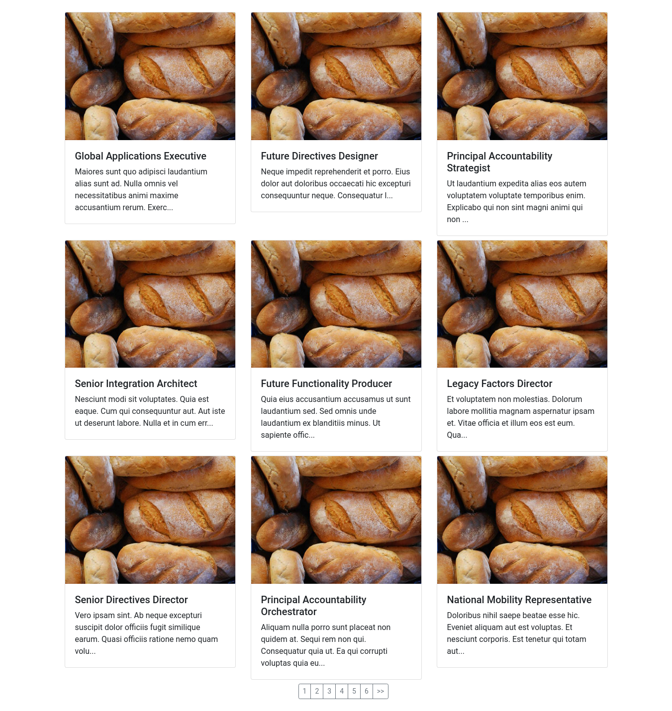

# Vuejs and Nodejs Pagination


## Ejecuta en Carpeta Backend y Public
```
npm install
```
### Carpeta Backend 
```
node src/index.js
ingresa a la ruta: http://localhost:3000/create y luego http://localhost:3000/articles
para ver los documentos generados.
```

### Carpeta Public
```
npm run serve 

```